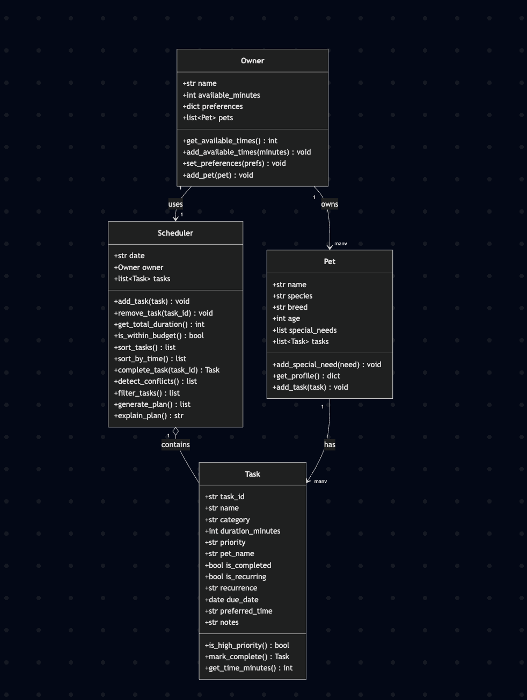

# PawPal+ (Module 2 Project)

You are building **PawPal+**, a Streamlit app that helps a pet owner plan care tasks for their pet.

## Scenario

A busy pet owner needs help staying consistent with pet care. They want an assistant that can:

- Track pet care tasks (walks, feeding, meds, enrichment, grooming, etc.)
- Consider constraints (time available, priority, owner preferences)
- Produce a daily plan and explain why it chose that plan


## App Functionalities 

The final app does the following:

- Let a user enter basic owner + pet info
- Let a user add/edit tasks (duration + priority at minimum)
- Generate a daily schedule/plan based on constraints and priorities
- Display the plan clearly (and ideally explain the reasoning)
- Include tests for the most important scheduling behaviors

## Getting started

### Setup

```bash
python -m venv .venv
source .venv/bin/activate  # Windows: .venv\Scripts\activate
pip install -r requirements.txt
```

### Suggested workflow

1. Read the scenario carefully and identify requirements and edge cases.
2. Draft a UML diagram (classes, attributes, methods, relationships).
3. Convert UML into Python class stubs (no logic yet).
4. Implement scheduling logic in small increments.
5. Add tests to verify key behaviors.
6. Connect your logic to the Streamlit UI in `app.py`.
7. Refine UML so it matches what you actually built.

## 🖥️ Sample Output

```
========================================
🐶🐱 TODAY'S SCHEDULE
========================================
╭────────┬────────────┬────────────────────┬───────┬────────────┬───────────╮
│ Time   │ Priority   │ Task               │ Pet   │ Duration   │ Status    │
├────────┼────────────┼────────────────────┼───────┼────────────┼───────────┤
│ 7:15am │ 🔴 HIGH     │ 🐾 Morning Walk     │ Buddy │ 30 min     │ ⏳ Pending │
│ 8:00am │ 🔴 HIGH     │ 🍖 Feed Breakfast   │ Buddy │ 10 min     │ ⏳ Pending │
│ 5:00pm │ 🔴 HIGH     │ 🍖 Feed Dinner      │ Luna  │ 10 min     │ ✅ Done    │
│ 9:30am │ 🟡 MEDIUM   │ 🧼 Clean Litter Box │ Luna  │ 15 min     │ ⏳ Pending │
│ 6:00pm │ 🟡 MEDIUM   │ 🐾 Evening Walk     │ Buddy │ 25 min     │ ⏳ Pending │
│ 6:45pm │ 🟢 LOW      │ 🧸 Evening Playtime │ Luna  │ 20 min     │ ⏳ Pending │
╰────────┴────────────┴────────────────────┴───────┴────────────┴───────────╯

⏱  Total: 110 / 120 min

========================================
🕒 SORTED BY TIME
========================================
╭────────┬────────────┬────────────────────┬───────┬────────────┬───────────╮
│ Time   │ Priority   │ Task               │ Pet   │ Duration   │ Status    │
├────────┼────────────┼────────────────────┼───────┼────────────┼───────────┤
│ 7:15am │ 🔴 HIGH     │ 🐾 Morning Walk     │ Buddy │ 30 min     │ ⏳ Pending │
│ 8:00am │ 🔴 HIGH     │ 🍖 Feed Breakfast   │ Buddy │ 10 min     │ ⏳ Pending │
│ 9:30am │ 🟡 MEDIUM   │ 🧼 Clean Litter Box │ Luna  │ 15 min     │ ⏳ Pending │
│ 5:00pm │ 🔴 HIGH     │ 🍖 Feed Dinner      │ Luna  │ 10 min     │ ✅ Done    │
│ 6:00pm │ 🟡 MEDIUM   │ 🐾 Evening Walk     │ Buddy │ 25 min     │ ⏳ Pending │
│ 6:45pm │ 🟢 LOW      │ 🧸 Evening Playtime │ Luna  │ 20 min     │ ⏳ Pending │
╰────────┴────────────┴────────────────────┴───────┴────────────┴───────────╯

========================================
🐕 FILTER: Buddy's tasks only
========================================
╭────────┬────────────┬──────────────────┬───────┬────────────┬───────────╮
│ Time   │ Priority   │ Task             │ Pet   │ Duration   │ Status    │
├────────┼────────────┼──────────────────┼───────┼────────────┼───────────┤
│ 7:15am │ 🔴 HIGH     │ 🐾 Morning Walk   │ Buddy │ 30 min     │ ⏳ Pending │
│ 8:00am │ 🔴 HIGH     │ 🍖 Feed Breakfast │ Buddy │ 10 min     │ ⏳ Pending │
│ 6:00pm │ 🟡 MEDIUM   │ 🐾 Evening Walk   │ Buddy │ 25 min     │ ⏳ Pending │
╰────────┴────────────┴──────────────────┴───────┴────────────┴───────────╯

========================================
⏳ FILTER: Incomplete tasks only
========================================
╭────────┬────────────┬────────────────────┬───────┬────────────┬───────────╮
│ Time   │ Priority   │ Task               │ Pet   │ Duration   │ Status    │
├────────┼────────────┼────────────────────┼───────┼────────────┼───────────┤
│ 7:15am │ 🔴 HIGH     │ 🐾 Morning Walk     │ Buddy │ 30 min     │ ⏳ Pending │
│ 8:00am │ 🔴 HIGH     │ 🍖 Feed Breakfast   │ Buddy │ 10 min     │ ⏳ Pending │
│ 6:00pm │ 🟡 MEDIUM   │ 🐾 Evening Walk     │ Buddy │ 25 min     │ ⏳ Pending │
│ 9:30am │ 🟡 MEDIUM   │ 🧼 Clean Litter Box │ Luna  │ 15 min     │ ⏳ Pending │
│ 6:45pm │ 🟢 LOW      │ 🧸 Evening Playtime │ Luna  │ 20 min     │ ⏳ Pending │
╰────────┴────────────┴────────────────────┴───────┴────────────┴───────────╯

========================================
✅ FILTER: Completed tasks only
========================================
╭────────┬────────────┬───────────────┬───────┬────────────┬──────────╮
│ Time   │ Priority   │ Task          │ Pet   │ Duration   │ Status   │
├────────┼────────────┼───────────────┼───────┼────────────┼──────────┤
│ 5:00pm │ 🔴 HIGH     │ 🍖 Feed Dinner │ Luna  │ 10 min     │ ✅ Done   │
╰────────┴────────────┴───────────────┴───────┴────────────┴──────────╯

========================================
⚠️  CONFLICT DETECTION TEST
========================================
⚠️  WARNING: 'Feed Breakfast' (Buddy) and 'Brush Teeth' (Buddy) are both scheduled at 8:00am.
⚠️  WARNING: 'Feed Breakfast' (Buddy) and 'Morning Meds' (Luna) are both scheduled at 8:00am.
⚠️  WARNING: 'Brush Teeth' (Buddy) and 'Morning Meds' (Luna) are both scheduled at 8:00am.
```

## 🧪 Testing PawPal+

### Test Descriptions:
Tests include checking if a tasks is properly marked true, if a pet's task count increases properly, if a schedule is properly sorted chronlogically (both by time and string), if a recurring task is properly made and added, if a non-recurring task produces no task, and if conflicts are properly detected or no conflict. 

Confidence level: 4/5 stars because tests ensure that functions work properly in multiple scenarios, whether something is added or not. However, without actually using the app we won't truly test to its limits.

How to run:

```bash
# Mac version:
python3 -m pytest
```

Sample test output:

```
tests/test_pawpal.py .............                                       [100%]

============================== 13 passed in 0.02s ==============================
Finished running tests!
```

## 📐 Smarter Scheduling

| Feature | Method(s) | Notes |
|---------|-----------|-------|
| Sort by priority + time | `Scheduler.sort_tasks()` | Sorts by priority (high → low), then by `preferred_time` as a tiebreaker |
| Sort by time only | `Scheduler.sort_by_time()` | Chronological order using `get_time_minutes()`; tasks with no time go last |
| Filtering | `Scheduler.filter_tasks()` | Filter by priority, pet name, preferred time, time window (after/before), or completion status |
| Conflict detection | `Scheduler.detect_conflicts()` | Pairwise check for tasks sharing the same `preferred_time`; returns warning strings without crashing |
| Recurring tasks | `Task.mark_complete()` / `Scheduler.complete_task()` | Daily tasks reschedule +1 day; weekly tasks reschedule +7 days using `timedelta` |
| Budget enforcement | `Scheduler.generate_plan()` / `is_within_budget()` | Tasks are selected in priority order until the owner's `available_minutes` is exhausted |

## 📸 Demo Walkthrough

### Main UI features

- **Owner & Pet Setup** — Enter the owner's name and daily available minutes, then add one or more pets (name, species, breed, age). Each new pet is attached to the current owner.
- **Tasks** — Once at least one pet exists, add care tasks by choosing the pet, a task title, duration, priority (low/medium/high), and a preferred time slot. Added tasks are checked against existing tasks for scheduling conflicts and shown in a running table.
- **Build Schedule** — Generates a daily plan by calling `Scheduler.generate_plan()`, which selects tasks in priority order until the owner's available time budget is used up. Shows the resulting schedule, any conflict warnings, a text explanation of the plan (`explain_plan()`), and a toggle to view the schedule sorted by priority or by time. Tasks that didn't fit in the time budget are listed separately as "Skipped."
- **Filter Scheduled Tasks** — After a schedule is generated, filter the scheduled tasks by priority, time window (morning/afternoon/evening), and/or pet name to quickly find specific tasks.

### Example workflow

1. Enter owner info ("Jordan", 120 available minutes) and add a pet ("Mochi", a dog) — click **Add pet**.
2. Add a task for Mochi, e.g. "Morning walk," 30 minutes, high priority, 7:00am — click **Add task**. Repeat for a few more tasks across priorities and times.
3. Click **Generate schedule** to build today's plan. The app fills the schedule in priority order until the time budget runs out, showing which tasks made it in and which were skipped.
4. Toggle between "sort by priority" and "sort by time" to see the same schedule reorganized.
5. Use the filter controls to narrow the scheduled tasks down to, say, only "high" priority tasks or only tasks for one pet.

### Key Scheduler behaviors shown

- **Sorting** — `sort_tasks()` orders tasks by priority (high → low) with preferred time as a tiebreaker; `sort_by_time()` instead orders purely chronologically, pushing tasks with no preferred time to the end.
- **Conflict warnings** — `detect_conflicts()` flags any tasks sharing the same preferred time slot as warnings (e.g. two tasks both set for 7:00am), without blocking the user from adding them.
- **Budget enforcement** — `generate_plan()` fills the schedule in priority order and stops once the owner's `available_minutes` is exhausted, moving any leftover tasks to the "Skipped" list.
- **Recurring tasks** — completing a daily task reschedules it +1 day, and a weekly task reschedules +7 days, via `Task.mark_complete()` / `Scheduler.complete_task()`.


## System Architecture

UML diagram that outlines how objects interact with each other



Source: [diagrams/uml_draft.mmd](diagrams/uml_draft.mmd)


### 🎨 Formatting features

Both `main.py` (CLI) and `app.py` (Streamlit) use color, emoji, and structured tables to make schedules easier to scan at a glance:

| Feature | Where | Implementation |
|---------|-------|-----------------|
| Structured tables | `main.py` | [`tabulate`](https://pypi.org/project/tabulate/) library (`tabulate(rows, headers=..., tablefmt="rounded_outline")`) renders task lists as boxed tables instead of manually padded strings. Added as a dependency in `requirements.txt`. |
| Color-coded priority/status | `main.py` | Raw ANSI escape codes (`RED`, `YELLOW`, `GREEN`, `CYAN`, `BOLD`, `MAGENTA` constants) wrap priority labels (red=high, yellow=medium, green=low) and status labels (cyan=pending, green=done) via `priority_label()` and `status_label()` helper functions — no extra dependency needed for terminal color. |
| Emoji task/priority/section indicators | `main.py`, `app.py` | `PRIORITY_ICONS`/`PRIORITY_BADGES` (🔴/🟡/🟢) and `CATEGORY_ICONS` (🐾 exercise, 🍖 feeding, 🧸 enrichment, 🧼 hygiene, 💊 health) dictionaries map task fields to emoji, applied per-row by `priority_label()`/`priority_badge()` and `category_icon()`. Section headers (`section()` helper in `main.py`) also get contextual emoji (e.g. 🕒 for time-sorted view, ⚠️ for conflicts). |
| Emoji status badges | `app.py` | `status_badge()` returns "✅ Done" / "⏳ Pending" for each task row; `st.success`/`st.warning`/`st.info` calls are prefixed with ✅/⚠️/ℹ️ so state changes are visually distinct in the Streamlit UI. |
| Reusable row formatting | `app.py` | `task_rows()` centralizes building the emoji/badge-annotated dict rows passed to `st.table()`, replacing the previous plain-text dict list literals used in each section (current tasks, scheduled tasks, skipped tasks, filtered tasks). |